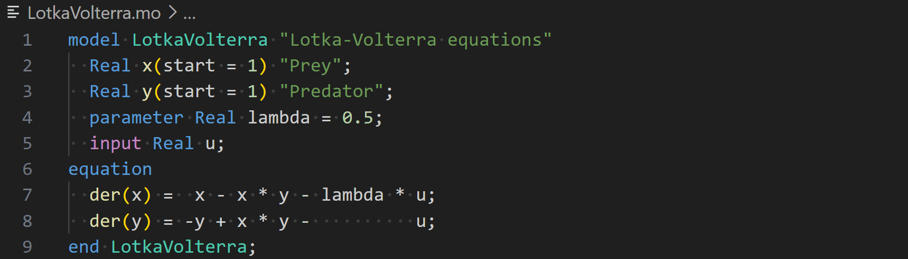
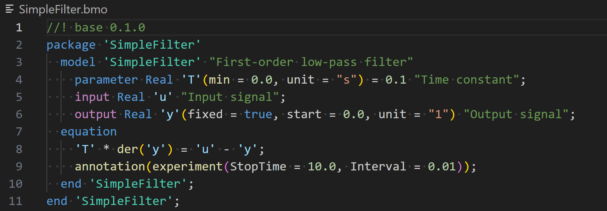
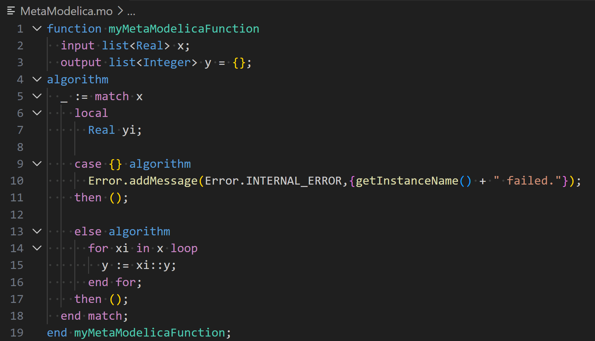
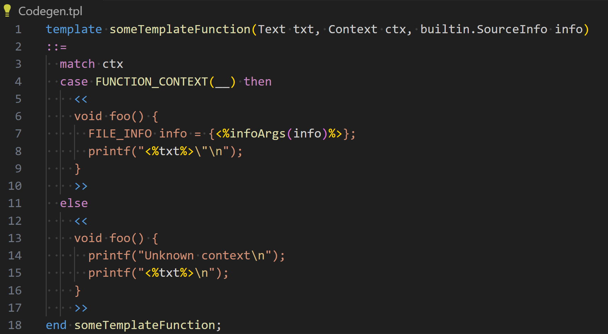
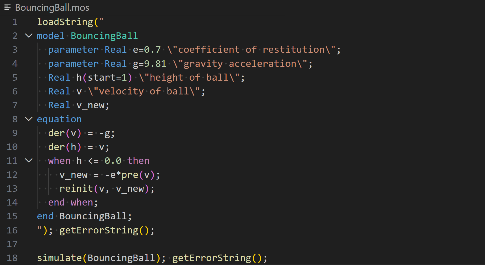
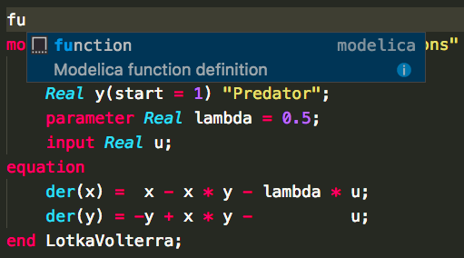
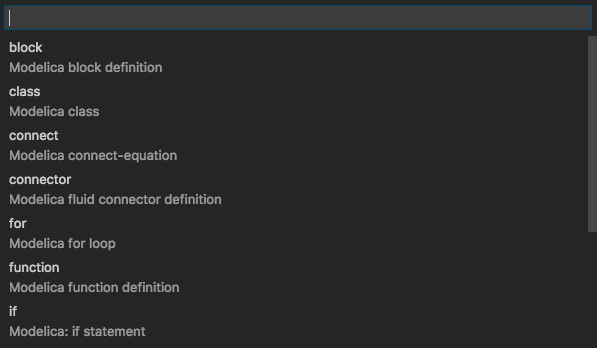

# Modelica, Base Modelica, MetaModelica, Susan and MOS Scripting in Visual Studio Code

[![CI][badge-test]][ci-workflow]

This extension adds support for the following Modelica and OpenModelica related
languages to Visual Studio Code:

* [Modelica 3.6][modelica-spec]
* Base Modelica ([Modelica Change Proposal 031][mcp-031])
* [Optimica][optimica-doc]
* [MetaModelica][metamodelica-doc]
* [Susan Templates][susan-doc]
* [OpenModelica Scripting API][openmodelica-scripting-api-doc]

## Features

### Syntax Highlighting

*Modelica Language:*


*Base Modelica Language:*


*MetaModelica language used by OpenModelica:*


*Susan template language used by OpenModelica:*


*OpenModelica scripting language used by OpenModelica's \*.mos files:*


### Snippets





## Usage

### Install the extension in VS Code

* Download the [VS Code extension file][releases].
* Open the command palette using `Ctrl+Shift+P` or `F1`.
* Type `extensions: Install from VSIX...` in the command palette.
* Browse to downloaded *.vsix file.

### Select MetaModelica as a language

* On the bottom-right corner, click on the *select language mode* button, if you
  have created a new file it should display *Plain Text*.
* Select *MetaModelica* or *Susan* or *Modelica* in the list of languages.

Alternatively, saving the file with a `.mo` extension will allow VS Code to
understand that it is a MetaModelica file and automatically select the language.
If it is a Modelica file one has to manually change the language mode to
*Modelica*. The `.mop` extension will be associated with the Optimica language
respectively. The `.tpl` extension will be associated with Susan Template
language. Additional extensions can be connected to the languages in any
`settings.json` file using the `"files.associations"` setting.

### Using snippets

Just start to type and choose a snippet that may be proposed. Alternatively, use
`Ctrl+Shift+P` to open the command palette and type `Insert Snippet` to see a
list of all possible snippets to choose from.

## Development

There is a dev container available to build and publish the extension.
See [publishing-extension] for more details on the publishing process.

### Dependencies

* Node.js
* VSCode
* sh (or translate [yaml2json.sh](./yaml2json.sh) to your shell equivalent)

### Build

```bash
npm install
```

Translate the `*.tmGrammar.yaml` files to `*.tmGrammar.json` JSON files.
Start build task (Ctrl+Shift+B)

```bash
npm run prebuild
```

### Test

Run the `tmGrammer tests` task:

* Open Command Palette (Ctrl+Shift+P)
* Type `tasks: Run task`
* Choose `tmGrammer tests`

or run it manually:

```bash
npm run test
```

### Build Package

Generate .vsix package file:

```bash
npm run build
```

### Publish package

#### Visual Studio Marketplace

```bash
npx vsce login <publisher name>
npx vsce publish
```

#### Open VSX

```bash
npx ovsx publish metamodelica-<version>.vsix -p <token>
```

## Acknowledgement

This extension is based on the Modelica extension
[SimplyDanny/modelica-language-vscode][upstream].

[badge-test]: https://github.com/AnHeuermann/metamodelica-language-vscode/actions/workflows/ci.yml/badge.svg
[ci-workflow]: https://github.com/AnHeuermann/metamodelica-language-vscode/actions/workflows/ci.yml
[mcp-031]: https://github.com/modelica/ModelicaSpecification/tree/MCP/0031/RationaleMCP/0031
[metamodelica-doc]: https://github.com/OpenModelica/OpenModelica/blob/master/doc/OpenModelicaMetaProgramming.pdf
[modelica-spec]: https://specification.modelica.org/maint/3.6/MLS.html
[openmodelica-scripting-api-doc]: https://openmodelica.org/doc/OpenModelicaUsersGuide/latest/scripting_api.html
[optimica-doc]: https://openmodelica.org/doc/OpenModelicaUsersGuide/latest/optimization.html
[publishing-extension]: https://code.visualstudio.com/api/working-with-extensions/publishing-extension#installation
[releases]: https://github.com/AnHeuermann/metamodelica-language-vscode/releases
[susan-doc]: https://github.com/OpenModelica/OpenModelica/blob/master/doc/OpenModelicaTemplateProgramming.pdf
[upstream]: https://github.com/SimplyDanny/modelica-language-vscode
