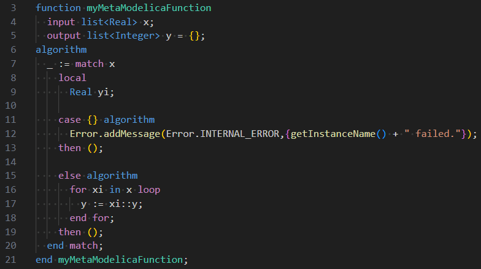
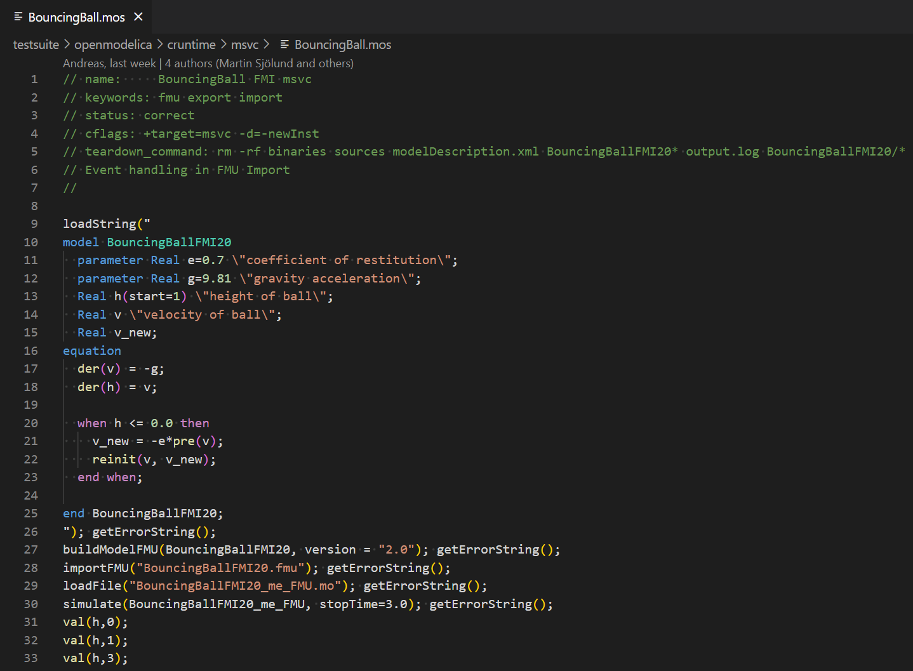

[](https://github.com/AnHeuermann/modelica-language-vscode/actions/workflows/ci.yml)

# MetaModelica and Susan in Visual Studio Code

This extension adds support for the Modelica, Optimica, MetaModelica and Susan
languages to Visual Studio Code. This extension is meant to use for developers
of OpenModelica. If you want Modelica support use the great extension [Modelica
by
SimplyDanny](https://marketplace.visualstudio.com/items?itemName=SimplyDanny.modelica)
which is the base for this extensions.

## Source

This extension is based on the Modelica extension
[SimplyDanny/modelica-language-vscode](https://github.com/SimplyDanny/modelica-language-vscode).

## Features

### Syntax Highlighting







### Snippets


## Usage

### Install the extension in VS Code

* Download the [VS Code extension file](https://github.com/AnHeuermann/modelica-language-vscode/releases/tag/v0.1.0).
* Open the command palette using `Ctrl+Shift+P` or `F1`.
* Type `extensions: Install from VSIX...` in the command palette.
* Browse to downloaded *.vsix file.

### Select MetaModelica as a language

* On the bottom-right corner, click on the *select language mode* button, if you
  have created a new file it should display *Plain Text*.
* Select *MetaModelica* or *Susan* or *Modelica* in the list of languages.

Alternatively, saving the file with a `.mo` extension will allow VS Code to
understand that it is a MetaModelica file and automatically select the language.
If it is a Modelica file one has to manually change the language mode to
*Modelica*. The `.mop` extension will be associated with the Optimica language
respectively. The `.tpl` extension will be associated with Susan Template
language. Additional extensions can be connected to the languages in any
`settings.json` file using the `"files.associations"` setting.

### Using snippets

Just start to type and choose a snippet that may be proposed. Alternatively, use
`Ctrl+Shift+P` to open the command palette and type `Insert Snippet` to see a
list of all possible snippets to choose from.

## Development

There is a dev container available to build and publish the extension.
See
[https://code.visualstudio.com/api/working-with-extensions/publishing-extension#installation](code.visualstudio.com/api/working-with-extensions/publishing-extension)
for more details on the publishing process.

### Dependencies

  - Node.js
  - VSCode
  - sh (or translate [yaml2json.sh](./yaml2json.sh) to your shell equivalent)

### Build

```bash
npm install
```

Translate the `*tmGrammar.yaml` files to `*.tmGrammar.json` JSON files.
Start build task (Ctrl+Shift+B)

```bash
npm run prebuild
```

### Test

Run the `tmGrammer tests` task:
  - Open Command Palette (Ctrl+Shift+P)
  - Type `tasks: Run task`
  - Choose `tmGrammer tests`

or run it manually:

```bash
npm run test
```

### Build Package

Generate .vsix package file:
```bash
npx vsce package
```

### Publish package

**Visual Studio Marketplace**

```bash
npx vsce login <publisher name>
npx vsce publish
```

**Open VSX**

```bash
npx ovsx publish metamodelica-<version>.vsix -p <token>
```
